# شجرة المقررات السابقة

الرسم ده بيوضّح إيه اللي لازم تخلّصه قبل إيه. اقراه من فوق لتحت: السهم معناه "لازم الأول".

---

## الرسم الكامل

```mermaid
graph TD
    MTHN001[MTHN001 Linear Algebra] --> MTHN102[MTHN102 Multivariable Calc]
    MTHN002[MTHN002 Calculus I] --> MTHN003[MTHN003 Calculus II]
    MTHN003 --> MTHN102
    MTHN003 --> ELCN102[ELCN102 Circuits-1]
    MTHN003 --> MTHN103[MTHN103 Differential Equations]

    MECN001[MECN001 Mechanics-1] --> MECN002[MECN002 Mechanics-2]
    MECN001 --> CVEN125[CVEN125 Civil Engineering]
    MECN001 --> INTN125[INTN125 Mechanical Eng]
    MECN002 --> INTN125

    PHYN001[PHYN001 Mechanics Waves Thermo] --> PHYN002[PHYN002 Electricity and Magnetism]
    PHYN001 --> PHYN102[PHYN102 Modern Physics]
    PHYN002 --> PHYN102
    PHYN002 --> ELCN101[ELCN101 Electronics-1]
    PHYN002 --> EMPN125[EMPN125 Electrical Power Eng]
    PHYN102 --> ELCN101
    PHYN002 --> PHYN212[PHYN212 Electromagnetics]
    MTHN102 --> PHYN212

    CMPN101[CMPN101 Logic Design-1] --> CMPN111[CMPN111 Logic Design-2]
    CMPN101 --> CMPN201[CMPN201 Microprocessor-1]
    CMPN101 --> ELCN100[ELCN100 Laboratory]
    CMPN103[CMPN103 Programming Techniques] --> CMPN102[CMPN102 Data Structures]
    MTHN104[MTHN104 Discrete Math] --> CMPN102
    CMPN103 --> CMPN202[CMPN202 Databases]
    CMPN103 --> CMPN203[CMPN203 Software Engineering]
    CMPN103 --> CMPN205[CMPN205 Computer Graphics]
    CMPN201 --> CMPN211[CMPN211 Microprocessor-2]
    CMPN201 --> CMPN301[CMPN301 Computer Architecture]
    CMPN301 --> CMPN303[CMPN303 Operating Systems]
    CMPN102 --> CMPN302[CMPN302 Algorithms]
    MTHN201[MTHN201 Numerical Analysis] --> CMPN302
    CMPN102 --> CMPN405[CMPN405 Computer Networks-1]
    CMPN201 --> CMPN405
    CMPN405 --> CMPN425[CMPN425 System Consultation]
    CMPN103 --> CMPN306[CMPN306 Advanced Programming]
    MTHN203[MTHN203 Probability] --> CMPN306
    CMPN102 --> CMPN403[CMPN403 Languages and Compilers]
    CMPN102 --> CMPN407[CMPN407 Modeling and Simulation]
    CMPN102 --> CMPN402[CMPN402 Machine Intelligence]
    MTHN203 --> CMPN402

    ELCN102 --> ELCN112[ELCN112 Circuits-2]
    MTHN102 --> ELCN112
    ELCN102 --> ELCN100
    ELCN101 --> ELCN201[ELCN201 Electronics-2]
    ELCN102 --> ELCN203[ELCN203 Signal Analysis]
    MTHN102 --> ELCN203
    MTHN102 --> ELCN304[ELCN304 Control-1]
    ELCN203 --> ELCN304
    ELCN203 --> ELCN306[ELCN306 Analogue Comms]
    MTHN203 --> ELCN306
    ELCN306 --> ELCN316[ELCN316 Digital Comms]
    MTHN203 --> ELCN316

    MTHN102 --> MTHN203
    MTHN102 --> MTHN201
    MTHN104 --> MTHN201

    CCEN480[CCEN480 Graduation Project-1] --> CCEN481[CCEN481 Graduation Project-2]
    GENN002[GENN002 English] --> GENN101[GENN101 Technical Writing]
```



---

## السلاسل الحرجة — خد بالك منها

السلاسل دي لو وقعت فيها في مقرر، بتتأخر فصل كامل على الأقل.

### سلسلة الحاسبات

```
CMPN103 → CMPN102 → CMPN302
CMPN101 → CMPN201 → CMPN301 → CMPN303
CMPN201 → CMPN405 → CMPN425
```

### سلسلة الاتصالات والإلكترونيات

```
PHYN002 → ELCN101 → ELCN201
MTHN003 → ELCN102 → ELCN112
ELCN102 + MTHN102 → ELCN203 → ELCN306 → ELCN316
```

### سلسلة الرياضة

```
MTHN002 → MTHN003 → MTHN102 → {MTHN203, MTHN201, ELCN203, PHYN212}
```

### سلسلة مشروع التخرج

```
CCEN480 → CCEN481
```

---

## جدول مبسّط: كل مقرر وفصله

| الفصل | المقررات |
|---|---|
| 1 | MECN001, MTHN001, MTHN002, PHYN001, MDPN001, GENN001, GENN004 |
| 2 | MECN002, CHEN001, MTHN003, PHYN002, MDPN002, GENN002, GENN003 |
| صيف 2 | GENN321, GENN326 |
| 3 | GENN101, CMPN101, CMPN102, ELCN102, MTHN102, PHYN102, CVEN125 |
| 4 | GENN102, ELCN100, CMPN103, ELCN101, ELCN112, MTHN103, MTHN104 |
| صيف 4 | CMPN403, CMPN407 |
| 5 | GENN201, CMPN201, CMPN202, ELCN201, EMPN125, INTN125, MTHN203, CCEN280 |
| 6 | PHYN212, GENN221, ELCN203, CMPN211, CMPN301, CMPN303, CMPN203 |
| صيف 6 | CCEN281, CMPN402, GENN301, CMPNXXX |
| 7 | GENN210, CMPN111, ELCN304, ELCN306, MTHN201, CCEN380, CMPNXXX |
| 8 | GENN204, CMPN205, CMPN306, CMPN302, CMPN405, CMPN425, ELCN316, CCEN480, CMPNXXX |
| صيف 8 | CCEN381, CMPNXXX, CMPNXXX |

---

## التحقق من صحة الرسم

الرسم ده مطابق تمامًا لجدول المقررات في ملف `course-inventory.md`. كل سهم في الرسم موجود في عمود "المقرر السابق" في الجدول، وكل شرط في الجدول له سهم هنا. لو لقيت أي اختلاف بين الملفين، الجدول هو المرجع.
